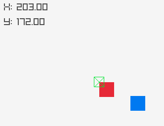

# NN2
Assignment for work Neural Networks II.

The bot thought to find its way to a blue square in a box2d physics world,
proxied as a gymnasium environment,
and rendered with raylib.

Questionable results
